# AutoCrypt V2X.platform 그룹<br> 리더 가이드

<br>

**:rocket: 신임 리더를 위한 바로서기 가이드**
<br>
하나부터 열까지, 모든 관리 업무가 처음인 리더를 위한 가이드. 탁월한 리더는 타고나는 것이 아니라 만들어지는 것입니다.

> **_Version:_**  1.0 (2023/01/12)
> 본 가이드는 사내 리더 가이드와 상호 보완적이도록 작성되었습니다

---

<!-- header: AutoCrypt V2X.platform 그룹 | 리더 가이드 | **목차** -->
<style scoped>
ul { columns: 2; }
</style>

# **목차**
- 관리의 이유
- 자기 관리
- 팀원의 감정
- 사고방식
- 감정지능
- 코칭하기
- 피드백
- 목표공유
- 의사결정
- 채용관리
- 평가하기
- 연간 일정표

---

<!-- header: AutoCrypt V2X.platform 그룹 | 리더 가이드 | **관리의 이유** -->
# <!--fit--> **관리의 이유**
관리란 대체 무엇인가? 관리는 해야만 할까? 무엇이 좋은 관리를 만들까?

---

# :test_tube: 프로젝트 옥시젠

관리는 해야만 하는 것일까? 2002년, 구글은 관리자를 모두 없애는 실험을 진행하였다. 결과는 재앙적이었고 실험은 금방 취소되었다.
2008년, 구글은 이러한 결과가 왜 나왔는지 분석하기 위해 **프로젝트 옥시젠**[1] 을 진행하였으며, 그 결과 관리자, 특히 탁월한 관리자가 필요하다는 결론을 내렸다.


여러 사람이 협력하는 집단이 더 좋은 성과를 내기 위해서는 관리자(리더)가 필요하다. 역으로, 리더의 본분을 **여러 사람이 협력하는 집단에서 더 좋은 성과를 도출하는 것**으로 정의해 볼 수도 있을 것이다.

프로젝트 옥시젠은 "관리자가 필요한가?" 에서 "모든 팀을 탁월한 관리자가 운영한다면 어떻게 될까?" 로 관점을 전환시켰다. 탁월한 관리자의 공통 행동은 다음과 같다:

> [[1] 프로젝트 옥시젠 보고서, 구글, 2008](https://rework.withgoogle.com/guides/managers-identify-what-makes-a-great-manager/steps/learn-about-googles-manager-research/)

---

# 리더는...[1]

- 좋은 코치이다
- 팀에 자율권을 주며, 사소한 것 까지 관여하지 않는다
- 포용성이 있는 환경을 만들며 개인의 성공과 행복에 관심을 가진다
- 생산적이며 결과지향적이다
- 좋은 소통자이며 잘 듣고 필요한 정보를 공유한다
- 경력 관리를 지원, 조언한다
- 자신의 조직에 대한 명확한 목표와 전략을 가지고 있다
- 자신의 조직에 필요한 조언을 할 수 있는 기술이 있다
- 명확한 의사 결정이 가능하다

> [[1] 프로젝트 옥시젠 보고서, 구글, 2008](https://rework.withgoogle.com/guides/managers-identify-what-makes-a-great-manager/steps/learn-about-googles-manager-research/)

---

# 탁월한 리더의 기준

탁월한 관리자도 재건이 필요한 팀에 부임한다면 초반에는 성과가 나쁠 수 있다. 반대로 무능한 관리자가 잘 조직된 팀에 부임하거나 직원들에게 철야를 강조하는 등의 방식으로 한두 분기 정도는 좋은 성과를 얻을 수도 있다.

탁월한 리더를 평가할 때는 **단기적인 관점** 뿐만 아니라 **장기적인 관점**에서도 바라보아야 한다.

리더의 팀 운영은 두 가지 기준으로 평가할 수 있다[1]:
- 팀이 가치 있고 완성도 있는 성과를 내는가?
	- 제품을 만드는 팀이라면, 사용하기 쉽고 완성도 있는 제품을 만드는가?
- 팀의 강점과 만족도는 높은가?
	- 팀원을 잘 성장시키고 있는가? 개개인은 즐겁게 협력하고 있는가?

> [1] 메타 최고제품책임자 크리스 콕스

---

# 세 가지 지침

다음 세 가지에 집중하면 팀의 성과를 향상시킬 수 있다:
- :dart: 목적
	- 팀 전체가 무엇이 성공인지 알고 그것에 집중하게 만들기
- :people_holding_hands: 사람
	- 신뢰 관계를 형성하고, 강점과 약점을 알고, 적절하게 위임하고, 코칭하기
- :bookmark_tabs: 프로세스
	- 의사결정과 협력 과정을 명확하게 하기

대개 실무 능력이 출중했던 개인 기여자가 리더가 되기 마련이다. 그러나 리더는 직접 실무를 보는 것을 자신의 역할로 두면 안 된다. 그래서는 팀의 성과가 선형적으로밖에 증가하지 않는다. 리더는 팀의 성과를 지수적으로 증가시켜야 한다.

---

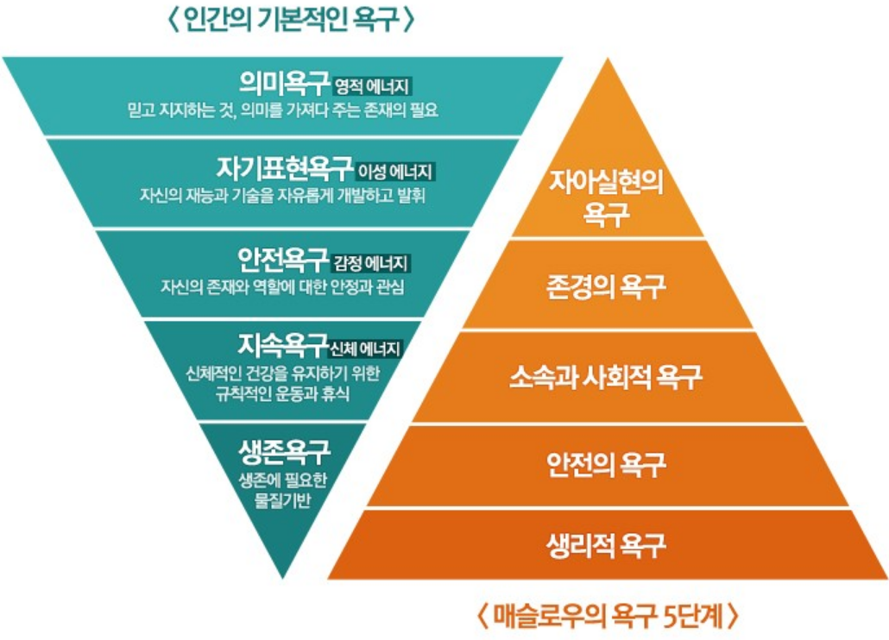

# :warning:	살아남아야 한다면

부임하자마자 처리해야 하는 피할 수 없는 업무가 산더미처럼 쌓여 있다면 어떻게 해야 할 것인가? 오늘을 살기가 급할 때에도 장기적인 관점에서 관리해야 하는가?

아니다. 당장 무너질 판일 때에는 안타깝지만 장기적인 관점은 잊는 것이 좋다. 위기 상황은 **일반적이지 않은** 상황이다. 이 때는 생존에만 집중해야 한다. 생존욕구를 넘어서야 지속욕구를 추구할 수 있다.

---

<!-- header: AutoCrypt V2X.platform 그룹 | 리더 가이드 | **자기 관리** -->
# <!--fit--> **자기 관리**
리더 스스로 자기 관리를 할 수 없다면 모두가 무너진다. 리더도 사람이다!

> 지금 세대의 팀장들은 산업혁명 이후 최고로 어려운 역할을 담당하고 있습니다.
> 고도성장기를 경험한 임원들과 가장 똑똑한 지적 노동자들 사이에서 중재자 역할을 수행해야 합니다. 작은 말실수 하나로도 SNS에 나쁜 리더로 낙인찍힐 수 있습니다. 가장 불쌍하면서도 어려운 직책이 리더입니다.
> 어려운 직무일수록 자기 관리가 선행되어야 합니다.

---

# :brain: 손으로 만든 뇌 모델 (1/2)


들어가기 전에, 뇌의 작동방식에 대해 간단히 이해해 보자. 각 부분의 역할은 다음과 같다:
- 변연계:
	- 감성적 판단을 관할
	- 생존 욕구에 의한 반응 담당
		- 투쟁 호르몬, 심장 박동수, 혈압, 호흡 조절
- 대뇌피질:
	- 이성적 사고와 창의력

> [손으로 만든 뇌 모델, Daniel Siegel, 2012](https://www.youtube.com/watch?v=gm9CIJ74Oxw)

---

# :brain: 손으로 만든 뇌 모델 (2/2)

**감정적 방아쇠** 가 당겨지면 변연계가 대뇌피질의 기능을 압도한다. 직접 손으로 뇌 모델을 만들어 본 뒤, 엄지를 감싸고 있던 나머지 네 손가락을 들어올려 보자. 변연계가 판단의 주체가 되었음을 표현하는 것이다.

감정적 방아쇠가 당겨졌을 때 사람은 상황에 지배된다. 즉, 이성적으로 대응할 수 없게 된다. 이성적이지 못한 사람은 다른 사람을 공포에 빠지게 한다.

이러한 상황에 대한 메타 인지를 가지고 있으면 한결 쉬운 대응이 가능하다. **감정적 방아쇠가 당겨지고 있다고 느껴질 때, 손으로 뇌 모델을 만들고, 네 손가락을 펴보자.** 다시 네 손가락으로 엄지손가락을 감쌀 때, 이성적 판단이 돌아올 것이다.

---

# 사기꾼 증후군

처음 리더가 되면 모든 것이 낯설다. 누구나 감당하기 벅차다고 느낀다. 이럴 때 사기꾼 증후군을 겪을 수 있다. 모두 제 역할을 하고 있는데 나 혼자만 내세울 게 없는 사람처럼 느껴진다. 리더가 겪는 사기꾼 증후군의 원인은 크게 두 가지다:
- 해답을 기대하는 눈빛을 많이 받는다
	- 팀원들이 개인적인 문제를 털어놓고 조언을 구할 때
	- 잘 모르는 업무에 대한 결정을 내려야 할 때
	- 내가 관여할 수 없었던 결정에 대해 해명해야 할 때
- 한 번도 해본 적 없는 일을 해야 할 때
	- 리더는 감정 노동자이다. 특히 인사, 노무 관련 업무는 미리 대비하기 어렵다

---

# 자신감 회복하기

리더가 사기꾼 증후군 등에서 자신감을 회복하기 위한 요령을 소개한다:
- 자책하지 않는다
	- 죄책감을 느끼면 스트레스가 더욱 심해진다
- 힘든 것을 인정하자
	- 동료, 친구, 상위 리더 등에게 고민을 표출하고 피드백을 받자
- 지레짐작하지 않는다
	- 특히 사람의 마음을 지레짐작하지 않도록 한다. 직접 확인하자
- 눈을 감아보자
	- 잠시 마음을 편안하게 하면 이성적 판단이 돌아온다
- 힘들 때일수록 자신을 보호하자
	- 자신을 위한 시간을 가지자. 몸과 마음의 상태가 업무 결과를 결정한다


---

# 기술 역량 유지하기

개발 조직의 리더는 다른 조직의 리더와 다르다. 기술 관리는 고도의 지적 노동자들을 관리하는 업무이다. 고도의 지적 노동자들에게 존중을 받으려면 그들에게 기술적으로 신뢰받을 수 있어야 한다. 기술적인 신뢰가 없다면 신뢰의 구축이 어렵다. 개발 조직의 리더는 기술적인 역량을 과소평가해서는 안 된다. 다음은 기술 역량을 유지하기 위한 조언이다:
- 가끔씩 직접 작은 기능을 구현하고 버그 수정을 한다
	- 병목 현상이나 프로세스 문제를 파악할 정도로는 제품을 알아야 한다(최소한)
	- 가능한 것과 불가능한 것의 구별에 도움이 된다
- 종종 페어 프로그래밍에 참여한다
	- 진행중인 업무의 기술적 문제를 가장 빠르게 파악할 수 있으며, 경험에 의한 조언이 가능하다
- 중요한 이슈의 코드 리뷰에 참여한다

---

# 업무 위임 (1/2)

많은 리더들이 업무를 감당하지 못할 때가 많다. 업무를 :monkey: 원숭이로 비유해보자.
업무를 감당하지 못하는 리더는 너무 많은 원숭이를 업고 있는 것이다.

리더는 원숭이(업무)를 정의하고, 누가 원숭이를 관리할 것인지를 결정해야 한다. 만약 어떤 문제에 대해 리더가 "제가 생각해보고 대응방안을 알려드리겠습니다" 라고 한다면, 원숭이는 지금 리더의 어깨로 옮겨온 것이다. 원숭이가 어깨에 많아질수록, 리더가 팀원을 관리하는 것이 아니라 원숭이를 떠맡고 있는 리더를 팀원이 관리하게 된다:

- 팀장님! 그 이슈 어떻게 대응할지 결정하셨나요? 그 전까지는 개발을 할 수 없어요

리더는 원숭이를 직접 관리하는 것을 피해야 한다. 원숭이를 적절하게 분배하고, 원숭이를 키우는 사람을 관리해야 한다.

---

# 업무 위임 (2/2)

업무를 위임하기 위한 간단한 관점 두 가지를 소개한다:

| 중요도/긴급성 | 긴급하지 않음 | 긴급함 |
| --- | --- | --- |
| 중요하지 않음 | 축소, 삭제 | 위임하나 축소, 삭제 |
| 중요함 | 기간을 정해 위임 | 당장 처리(직접) |

| 복잡도/빈도 | 빈번하지 않음 | 빈번함 |
| --- | --- | --- |
| 단순함 | 직접 처리 | 위임 |
| 복잡함 | 교육 목적의 위임 | 신중하게 위임 |

---

# 팀장 승진 후 첫 분기

당신이 리더가 된 과정에 따라 첫 분기가 달랐을 것이다:

- 견습생: 팀의 규모가 커져 그 중 일부를 맡게 됨
- 개척자: 갓 만들어진 새로운 집단의 리더가 됨
- 후계자: 기존 관리자가 자신의 자리를 물려줌
- 부임자: 완전히 다른 조직으로부터 부임함

각각의 경우에서 흔히 벌어지는 상황을 알아보자.

---

# 견습생

유리한 점:
- 상사에게 많은 도움을 받을 수 있음
- 무엇이 통하고, 통하지 않는지 알고 있음
- 내부자이므로 빨리 적응할 수 있음

주의할 점:
- 동기를 대할 때 조심해야 함
- 개인 기여자와 리더의 역할 사이에서 균형을 잡아야 함
	- 인원이 몇 안 되는 경우가 많으므로, 개인 기여자로서 실무도 처리해야 함
	- 팀이 커졌을 때 개인 기여를 내려놓을 수 있어야 함

---

# 개척자

유리한 점:
- 직접 키운 팀이므로 무엇이 필요한지 잘 앎
- 자신이 원하는 팀을 만들 수 있음

주의할 점:
- 지원을 많이 못 받을 수 있음
	- 당신밖에 그 업무를 모를 수 있음. 필요성 설득도 직접 해야 함
- (견습생과 같이)개인 기여자와 리더의 역할 사이에서 균형을 잡아야 함

---

# 후계자

유리한 점:
- 견습생과 같음

주의할 점:
- 동기를 대할 때 조심해야 함
- 전임자의 빈자리가 크게 느껴질 수 있음
- 커진 책임에 따른 중압감을 잘 관리해야 함
- 전임자의 판박이가 되어야 한다는 압박감을 느낌
	- 그렇지 않다!

---

# 부임자

유리한 점:
- 처음에는 모두들 봐줌
	- 아직 팀에 익숙하지 않음을 알기에 초기에 도움을 요청하기 편함
- 백지 상태에서 시작할 수 있음
	- 나를 아는 사람이 없음. 새로운 시도가 가능

주의할 점:
- 적응에 시간이 걸림
	- 기술의 난이도가 높을수록 더 많은 시간이 필요
- 새로이 신뢰간계를 형성하기 위해 노력해야 함
- 팀의 정확한 상황을 모름

---

# 거울 보기

리더의 약점은 상속된다. 부모가 겪은 가정폭력이 자녀에게 대물림 되는 것과 같다[1].
구성원의 약점을 볼 때마다 자신이 그 근원이 아닌지 생각해 보는 것이 좋다. 약점은 증폭되어 상속되는 경향이 있기 때문에 더욱 조심해야 한다.

예를 들어, 방어적으로 업무를 하는 리더의 팀원들은 방어적인 업무 방식을 따라한다. 프로세스를 중시하는 리더의 팀원들은 프로세스에 의존하며 융퉁성이 부족해진다.

자기애가 심각할 정도로 강한 나르시시스트 리더의 팀원들은 자존감이 낮을 가능성이 크다. 개개인의 공은 리더만의 공이 되는 반면, 리더의 개인적 실패는 개개인에게 떠넘겨지기 때문이다.

친구나 선생만이 코치가 될 수 있는 것이 아니다. 팀원의 행동을 통해 자신의 행동을 돌아볼 수 있다.

> [[1] 부모가 겪은 가정폭력, 자녀에 대물림 된다, 보건사회연구소, 2019](https://www.segye.com/newsView/20190604512679)

---

<!-- header: AutoCrypt V2X.platform 그룹 | 리더 가이드 | **팀원의 감정** -->
# <!--fit--> **팀원의 감정**
리더가 될 때, 많은 이가 위험한 감정 경계선을 넘어선다. 즉, 팀원들의 감정을 관리하려 든다. 그것은 지나친 간섭이다. 모든 이는 감정적인 삶의 주체다. 다른 사람의 감정을 통제하여 문제를 해결할 수는 없다[1].

> [1] 실리콘밸리의 팀장들, 킴 스콧, 2019

---

# 나의 다음


중심을 지키고 바로 섰다면 이제 다른 사람을 도울 순간이다. 최고의 자아를 일터로 데려왔다면, 이제 팀이 성과를 올리게 도와야 한다.

하지만 팀을 돕기 전에 먼저 할 일이 있다. 바로 팀원들 개개인과 신뢰 관계를 구축하는 일이다.

신뢰 관계 구축의 원칙:
- 일방적인 권한을 포기하라
	- 권력과 통제는 허상이다
	- 실질적인 충족감은 관계에서 나온다
- 솔직하라

---

# 경계를 존중하기

다음은 감정 경계를 존중하기 위한 실천법이다:
- 감정을 인식하자
	- "개인적인 문제군요" 등으로 넘기지 말자
- 질문하자
	- 어떤 문제가 있는지 납득할 수 있을 때까지 질문하자
- 상대의 격한 감정에 자신의 죄책감을 더하지 말자
- 감정에 대한 강요는 역효과를 낳는다
- 상대의 감정 폭발을 제어할 수 없다고 해도 자책하지 말자
- 관계를 구축하자
	- 관계 구축은 리더의 핵심 업무임을 인식하라

---

# 경계를 존중하기 - 가스라이팅


**다 너를 생각해서 하는 말이야**

자기 자신을 생각해서 하는 말이 아닌지 곰곰히 생각해 보아야 한다.

'너를 생각해서' 가 아니라 '나를 생각해서' 였다는 사실이 밝혀지면 오랜 기간 쌓아온 신뢰 관계도 무너진다.

개인적인 부분에 대한 대화에서 특히 주의하라. 경력 등 개인적인 부분에 대해서는 조언만 하고, 결정은 상대가 하게 두어야 한다.

---

# 솔직해지기

피드백을 하다 보면 칭찬이 필요할 때도 있고 지적이 필요할 때도 있다. 인간은 관계의 동물이기 때문에 솔직한 피드백은 리더에게도 부담스러우나, 마찬가지의 이유로 관계에서는 솔직해야 한다. 사람은 사람의 진정성을 쉽게 읽어내기 때문이다.

솔직함은 또한 시의적절해야 한다. 한참 전의 사건에 대해 솔직해지는 것은 곤란하다.

---

# 피드백 유형 사분면 (1/2)

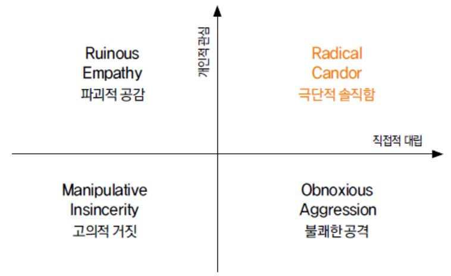

구글과 애플 등을 거쳐 실리콘밸리 CEO들의 리더십 코치 역할을 하고 있는 킴 스콧은 그의 저서 "실리콘밸리의 팀장들[1]"에서 상사와 부하의 소통을 네 가지 유형으로 나눴다.

이 도표는 리더의 유형이 아닌 관계의 유형임에 유의하자. 리더는 관계로써 극단적 솔직함을 추구해야 한다.

> [1] 실리콘밸리의 팀장들, 킴 스콧, 2019

---

# 피드백 유형 사분면 (2/3)

다음은 각 유형에 대한 설명이다:
- 극단적 솔직함
	- 상대를 위하면서도 솔직하게 문제를 제기함
- 파괴적인 공감
	- 상대를 위하나 부정적 반응을 두려워해 문제를 제기하지 못함
- 불쾌한 공격성
	- 상대에게 관심이 없이 문제를 제기함
- 고의적 거짓(관리 불성실)
	- 관심도 없고 문제도 제기하지 않음

---

# 피드백 유형 사분면 (3/3)

리더가 추가해야 할 모습은 극단적인 솔직함이다. 처음 들을 때는 기분이 나쁠지 몰라도 그것이 본인의 성장에 도움이 된다면 듣는 사람도 결국 받아들인다. 단, 여전히 경계를 존중해야 한다. 특히 자기 합리화를 통해 거짓 솔직함을 만들어서는 안 된다.

그때그때 쓴소리를 하지 않고 지나가면 타이밍을 놓친다. 극단적인 솔직함 또한 시의적절해야 한다. 같은 잘못이 여러 번 반복되더라도, 지난번에 그냥 넘어갔다면 이제 와서 뭐라고 하기도 어렵다. 타이밍이 중요하다.

---

# 심리적 안전감 (1/2)

심리적 안전감은 개인적으로 위험을 감수해도 팀이 안전하다는 팀원 전체의 공통 믿음이다. 다음 질문을 통해 팀에 심리적 안전감이 있는지 확인할 수 있다[1]:

- 이 팀에서 실수를 했을 때 나에게 개인적으로 불리하게 작용되지 않는다
- 이 팀의 구성원들은 어려운 문제나 장애물을 공유하는 능력이 있다
- 이 팀은 특이하다는 이유로 사람을 거부하지 않는다
- 이 팀에서는 위험을 감수하고 새로운 시도를 해도 괜찮다
- 이 팀에서는 쉽게 도움을 구할 수 있다
- 이 팀의 누구도 내 공을 의도적으로 폄하하지 않는다
- 이 팀에서 나의 기술과 재능은 가치를 인정받고 잘 활용된다

> [[1] Building a psychologically safe workplace, TEDx Talks, 2014](https://www.youtube.com/watch?v=LhoLuui9gX8)

---

# 심리적 안전감 (2/2)

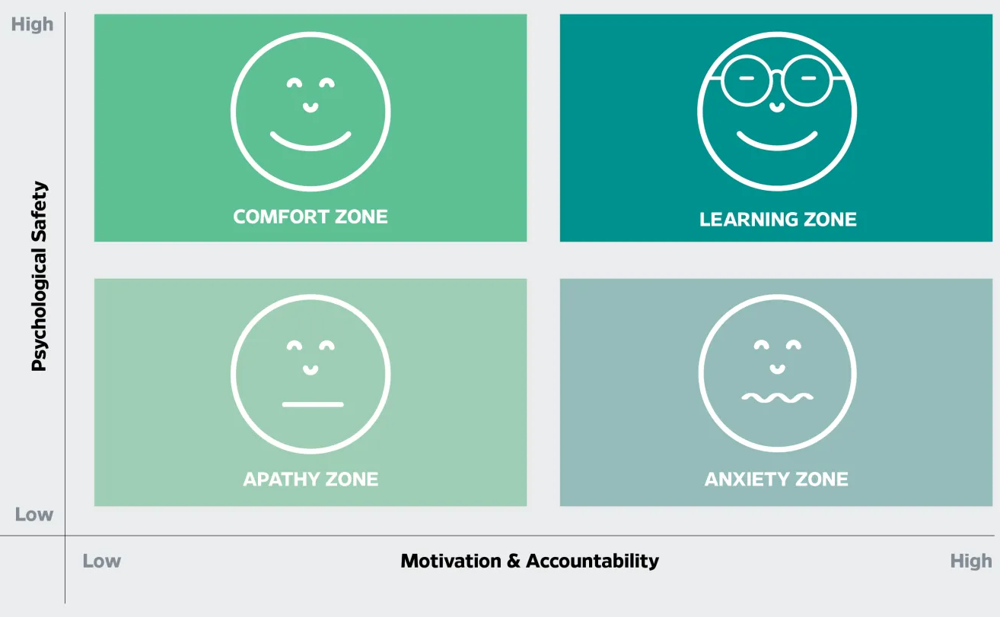

동기 부여는 심리적 안전감과 떼어놓을 수 없다. 심리적 안전감 없이 동기 부여를 시도하면 개인을 불안하게 만들 뿐이다.

---

# 팀원의 행복 - **한가지 약속** 기법 (1/2)

**한가지 약속** 은 팀원의 행복(well-being)을 위해 리더와 팀원이 합의 가능한 한가지 간단한 약속이다. 정기적인 회의(분기 등)시에 **한가지 약속**을 합의할 수 있다.

**규칙**
- 팀원이 **한가지 약속**을 먼저 작성한다
- **한가지 약속**은 한가지 요망만을 포함한다
- **한가지 약속**은 팀원의 행복과 관련된 주제를 가진다
- 리더는 지킬 수 있는 합의를 하도록 한다
- **한가지 약속**은 공개되거나 공유될 수 있는 내용으로 작성한다

---

# 팀원의 행복 - **한가지 약속** 기법 (2/2)

**예시**
- 5시에는 퇴근하여 딸과 놀아주겠다
- 주말에는 메일 및 팀즈를 확인하지 않겠다
- 이번 달 휴가중에는 업무 확인을 하지 않겠다
- 이번 분기 점심시간에는 홀로 PT를 받고 오겠다

---

<!-- header: AutoCrypt V2X.platform 그룹 | 리더 가이드 | **사고방식** -->
# <!--fit--> **사고방식**

성인도 성장할 수 있는가? 리더는 구성원들을 더 훌륭하고 똑똑한 사람으로 만들 수도 있고, 구성원들의 지성과 능력을 없앨 수도 있다 이들의 가장 큰 차이는 **주변 사람들이 성장할 수 있다고 믿는가** 이다[1].

> [1] 멀티플라이어, 리즈 와이즈먼, 2012

---

# 고정형 사고방식 vs 성장형 사고방식[1]

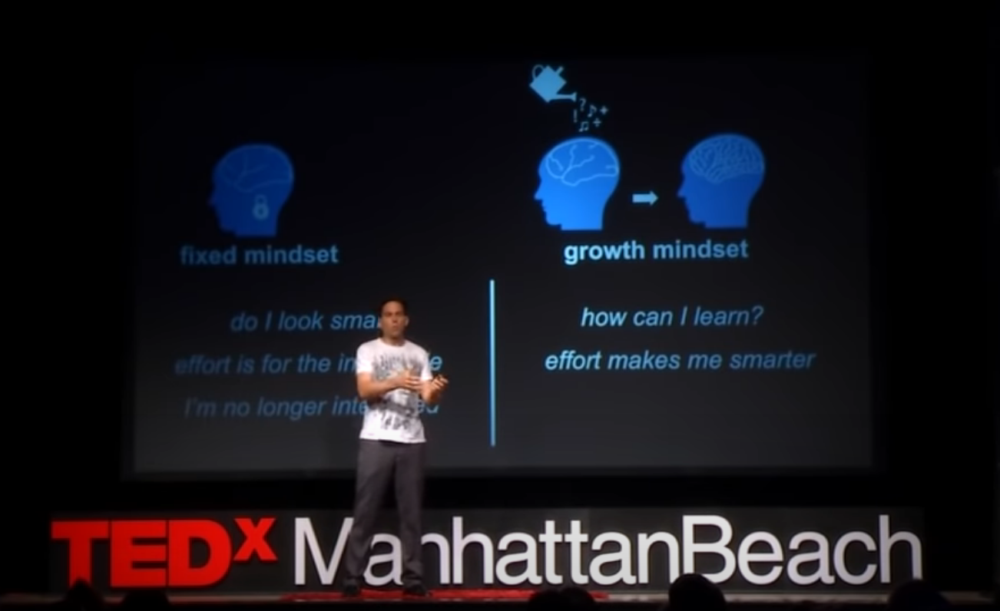

사고방식은 리더와 팀원 모두에게 중요하다. 우리는 **학습을 통해 성장할 수 있다**. 자신과 구성원이 성장형 사고방식을 가질 수 있도록 꾸준히 노력하자.

> [[1] The Power of belief, TEDx Talks, 2012](https://www.youtube.com/watch?v=pN34FNbOKXc)

---

<!-- header: AutoCrypt V2X.platform 그룹 | 리더 가이드 | **감정지능** -->
# <!--fit--> **감정지능**
탁월한 리더는 타고나는 게 아니라 만들어지는 것이다[1].

> [1] 팀장의 탄생, 줄리 주오, 2019

---

# 감정지능은 무엇인가

감정지능(Emotional Intelligence, EI)은 스스로와 타인의 감정을 인지하고, 이러한 인지를 통해 스스로의 행동과 사람 간의 관계를 관리하는 능력이다.

인지지능(Cognitive Intelligence, IQ)은 새로운 상황을 인지하거나, 주어진 문제를 이해하거나, 지식을 현재 상황에 적용하는 능력이다. 추상적 사고력과 추론력에 영향을 받는다.


감정지능은 복잡한 업무를 수행하는데 필요하며, 특히 리더 업무에 필수적이다.

---

# 감정지능은 **학습 가능하다**

- 감정지능의 역량은 필요 기술들을 배우도록 동기부여하고 가이드를 제시함으로써 점차 증가한다
- 감정지능의 핵심은 변연계이며, 변연계는 동기 부여, 지속적 훈련과 피드백을 통해 훈련 가능하다
- 감정지능을 최적화하려면 다음이 필요하다:
	- 정보(information)
	- 동기(motivation)
	- 실천(practice)
	- 행동에 대한 지속적 피드백을 받을 수 있는 열린 마음

---

# 타인과의 관계 (1/3)

감정지능 중 **타인의 감정 인지**를 살펴본다. 다음은 세 가지 감정 인지 행동이다:

- 동감(Sympathy)
	- 다른 사람의 감정을 이해할 수 있음
	- "네가 고통받고 있다는 걸 알겠어"
- 공감(Empathy)
	- 다른 사람의 감정에 이입할 수 있음
	- "네 고통을 이해해"
- 연민(Compassion)
	- 다른 사람의 감정적 고통을 덜어주고 싶음
	- "너를 도와주고 싶어"

---

# 타인과의 관계 (2/3)

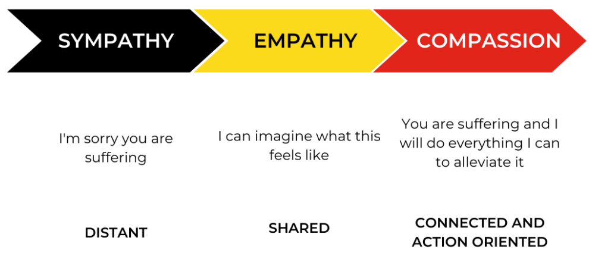

---

# 타인과의 관계 (3/3)

리더는 공감에서 끝나지 말고 연민으로 나아가야 한다. 왜 그러할까?

- 공감은 원인을 해결하지 않기 때문에 공감자에게도 스트레스와 번아웃을 가져올 수 있음
- 뇌과학적으로 공감을 느끼는 부분은 고통을 느끼는 부분과 같음

연민은 다음 부분에서 공감과 다르다:

- 연민은 돕기 위한 감정이므로 염려와 따스함이 수반됨
- 연민은 원인에 접근하기 때문에 스트레스를 감소시킬 수 있음

공감에서 객관화가 일어나야 연민이 될 수 있다. 자신의 감정과 상대의 감정 사이에 충분한 공간을 만들어야 연민을 할 수 있다.

---

<!-- header: AutoCrypt V2X.platform 그룹 | 리더 가이드 | **코칭하기** -->
# <!--fit--> **코칭하기**

코칭은 개인의 잠재능력을 풀어내어 성과를 향상시키는 행위이다. 코칭은 가르치기보다 스스로 학습하게 한다[1].

> [1] 성과 향상을 위한 코칭 리더십, 존 휘트모어, 2002

---

# 코칭의 정의[1]

- 적시에 적절한 피드백을 제공하는 것
- 긍정적인(동기부여적인) 피드백과 부정적인(교정적인) 피드백의 균형을 잡는 것
- 개개인의 장점과 특기분야를 이해하는 것
- 개인과 상황을 확인하여 맞춤화 하는 것
- 해법을 제안하는 것
- 정기적인 원온원 대화를 갖는 것

> [[1] 프로젝트 옥시젠 보고서, 구글, 2008](https://rework.withgoogle.com/guides/managers-identify-what-makes-a-great-manager/steps/learn-about-googles-manager-research/)

---

# 코칭의 연속성


---

# 언제 코칭해야 하는가[1]?

- 잠재성이 큰 사람을 대할 때
	- 성장을 위해 코칭한다
- 지적 노동자와 일할 때
	- 리더가 항상 구성원보다 기술적 지식이 많지 않다면, "전문가" 리더쉽은 어렵다
- 헌신이 통제를 압도할 때
	- 개개인 헌신을 강화하는게 통제하려는 시도보다 중요하다면 통제를 포기하라
	- 지적 노동자와 협업할 때 중요함
- 관계를 관리하는 것이 핵심일 때
	- PO, PM 직무 등의 경우 관계 관리가 업무의 핵심이다

> [1], Keys to Coaching Your Employees, Ed Batista, 2014

---

# 언제 코칭하지 **말아야** 하는가[1]?

- 심각한 수준의 저성과자를 대할 때(채용 부분 참고)
	- 코칭은 성과 계획이 아니다
- 당신이 정답을 알고 있을 때
	- 명확하게 답을 알고 있다면 질의하지 말고 지시하라
	- 시간적 여유가 있을 때 교육 목적의 코칭은 가능하다
- 통제가 헌신보다 중요할 때
	- 주기적인 업무 등이 해당된다
- 당신이 코칭 대상자가 목표를 달성하리라 믿고 있지 않을 때
	- 코치 스스로가 성장형 사고방식을 가지고 있지 않을 수 있다. <br>행동하기 전에 점검하라
- 보안이나 법적 문제가 있는 이슈일 때

> [1], Keys to Coaching Your Employees, Ed Batista, 2014

---

# 좋은 코치가 되는 법

- 코칭 대상자를 이해하고 대상자에게 집중하라
	- 태도가 중요하다. 코칭 중에는 대상자에게 집중하고 있어야 한다
- 당신의 사고방식과 코칭 대상자의 사고방식을 숙지하라
	- 둘 다 성장형 사고방식을 가지도록 노력해야 한다
- 공감적 듣기를 실천하라
	- 상대가 말하고 있는 내용 뿐만 아니라, 상대의 감정, 분위기, 목소리도 파악하라
- 개방형 질문을 통해 코칭 대상자의 시야를 확장시켜라
	- "**왜**" 보다 "**누가, 언제, 어디서**", 최종적으로 "**무엇을, 어떻게**" 를 질문하라

---

# 코칭 대상자를 이해하고 대상자에게 집중하라

다음은 집중을 위한 몇 가지 조언이다:
- 개인적이고 조용한 공간을 골라라
- 노트북, 스마트폰 등을 치워라
- 종이와 펜을 가져가서 필기하라
- 코칭 시간 전후로 버퍼 시간을 가지라
- 코칭 직전에 스스로를 점검하라

---

# GROW 모델[1]

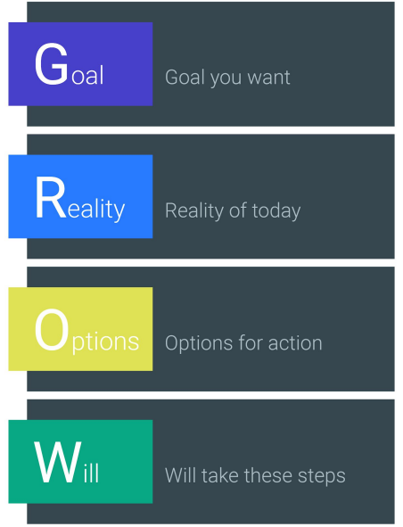

GROW 모델은 간단하게 사용할 수 있는 코칭 도구이다. 코칭 대상자가 GROW 모델을 이해하고 있을 필요는 없다.
GROW 모델의 템플릿 등도 준비하지 않아도 좋다. 코칭 시에 다음 네 가지에 주의를 기울이자:
- 목표: 코칭 대상자가 원하는 것
- 현실: 코칭 대상자의 현재 상태
- 옵션: 코칭 대상자가 할 수 있는 행동
- 의지: 어떤 행동을 할 것인가

> [1] You Already Know How to Be Great, Alan Fine, 2010

---

# GROW 모델이 효과적인 상황

GROW 모델은 다음 상황에서 효과적이다:

- 코칭 대상자:
	- 앞으로 나아가기 위해 코칭을 원함
	- 무엇에 대해 코치를 받을 지 결정권한이 있음
		- 직접 이슈를 구체화할 수 있음
- 코치:
	- 조력자가 될 수 있음
	- (명확하지 않더라도)해결방안을 구조화할 수 있음
	- 코칭 대상자가 결과 행동을 선택하게 할 수 있음

---

# (G): Goal

**목표**:
목표를 확실하게 하라. 코칭 대상자의 말을 유심히 듣고, 그가 바꾸고자 하는 것을 파악하라. 파악된 내용을 목표로 구조화하고, 코칭 대상자가 그것을 원하는 것이 맞는지 확인하라.

**전략**:
- 많은 질문을 하여 코칭 대상자가 원하는 것을 명확하게 정의하라

**팁**:
- 원온원 코칭이라면 목표는 코칭 대상자가 사전에 정리해 오도록 한다

---

# (R): Reality

**목표**:
현재 상황을 점검한다. 코칭 대상자가 현재 상황을 명확하게 이해하도록 하여 나아갈 길을 올바르게 탐색할 수 있게 한다.

**전략**:
- 주관적 판단보다 객관적 인지를 유도하라
- 코칭 대상자가 이슈를 얼마나 중요하게 여기는가에 집중하라

**팁**:
세부사항까지 알기 위해 시간을 너무 사용하지 마시오! 코칭은 코치의 궁금증을 해결하기 위한 자리가 아님

---

# (O): Options

**목표**:
가능한 행동들을 정리한다. 무엇이 가능하고 무엇이 가능하지 않은지 확인한다. 코칭 대상자의 목표 달성을 위해 어떤 행동이 가능한지 점검한다.

**전략**:
- 열린 마음으로 브레인스토밍 수행
- 가능성 탐색부터 수행해도 좋고, 가능하다는 가정 하에 선택사항을 넓게 탐색해도 좋다
- 이 단계에서 막힌다면 G, R 단계로 되돌아간다

---

# (W): Will, Wrap-up

**목표**:
목표를 달성하기 위한 행동을 결정하게 한다. 코칭 대상자에게 동기부여하고 또한 코칭 대상자의 의지를 확인한다.

**전략**:
- 행동을 결정하고, 가능하다면 결정을 더 구체화한다(언제까지 얼만큼 한다 등)
- 코치는 도전적인 조언을 할 수 있다. 코칭 대상자는 이를 반드시 받아들일 필요는 없다(코치가 인지시킬 것)

**팁**:
- 코칭 대상자가 명확하게 이해했는지 확인하기 위해 디브리핑을 수행할 수 있다
	- 정확히 이해했는지 여부를 코칭 대상자의 입으로 확인한다

---

# GROW 모델 응용 - 팀원 경력 관리

<style scoped>
ul {
	font-size: 25px;
	columns: 2;
}
</style>

다음은 GROW 모델을 통한 경력관리 코칭의 예시이다.

- Goal: 원하는 것이 무엇인가?
	- 1년, 5년, 10년 뒤에 되고 싶은 모습이 있나요?
	- 돈이나 기술이 충분히 있다면 무엇을 하고 싶나요?
- Reality: 현재 상태 파악하기
	- 현재 직무의 재미있는 부분이나 실망스런 부분이 무엇인가요?
	- 당신의 강점, 약점에 대해 피드백을 받은 적이 있나요? 공유해 줄 수 있나요?
- Options: 무엇을 할 수 있는가?
	- 경력 향상을 위해 당장 학습할 수 있는 자료가 있나요?
	- 당신에게 도움이 될 수 있는 기술적 업무나 멘토가 있나요?
- Will/Wrap-up: 어떻게 할 것인가?
	- 언제부터 무엇을 시작할 것인가요?
	- 무엇을 해주면 도움이 될까요?

---

<!-- header: AutoCrypt V2X.platform 그룹 | 리더 가이드 | **피드백** -->
# <!--fit--> **피드백**
"그 정도는 알 거라고 생각했어요"
서로에 대해 쌍방향으로 이야기하는 시간을 가져야 합니다.

---

# 피드백의 네 가지 유형[1]

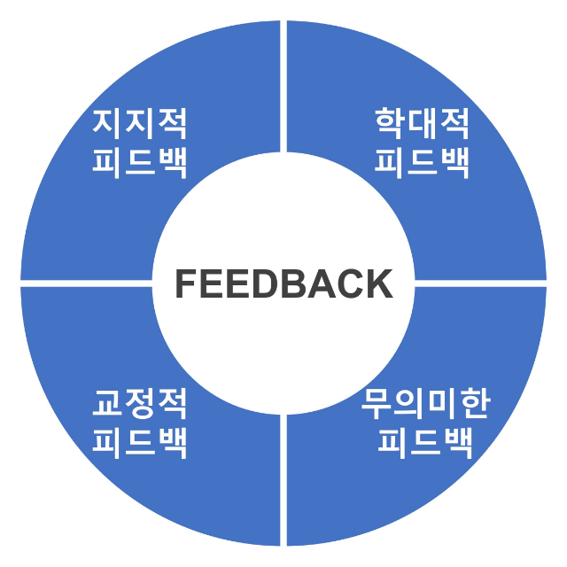

**지지적 피드백**:
상대방의 특정 행동이 반복되고 강화될 수 있도록 하는 피드백

**교정적 피드백**:
잘못된 행동의 변화를 목적으로 하는 피드백

**학대적 피드백**:
상처와 절망을 안겨주는 감정적인 피드백

**무의미한 피드백**:
형식적으로 진행하는 피드백

> [1] Tell me how I'm doing, 리차드 윌리엄스, 2007

---

# 피드백 지침 (1/2)

- 지지적 피드백과 교정적 피드백을 하도록 노력한다
- 교정적 피드백은 반드시 일대일로 한다
	- 개방된 공간에서 교정적 피드백을 진행하면 행동의 변화보다 수치심과 분노가 먼저 온다
- 칭찬받는 것을 어려워하는 사람에게는 지지적 피드백 또한 일대일로 한다
- 억지로 칭찬하지 않는다
	- 지지적 피드백 사이에 교정적 피드백을 넣기를 권하는 샌드위치 기법이 있다. 샌드위치 기법은 교정적 피드백의 효과를 반감시킨다
- 무엇을 기대하는지 평소에 명확히 밝혀라
	- 기대치를 제시하지 않고 교정적 피드백을 수행하면 공정하지 못하고, 반발이 심할 수 있다

---

# 피드백 지침 (2/2)

- 감정적이지 않게 피드백한다
	- 화가 났다면 그 상황에서 피드백하지 말고 참아라
	- 푹 쉬고, 맛있는 것을 먹고, 손으로 뇌 모델을 만들어 보라
	- 이성적이 된 뒤에 피드백하라
- 적시에 피드백한다
	- 지지적 피드백, 교정적 피드백을 불문하고 적시에 피드백해야 한다
	- 이미 시간이 지났다면 피드백하지 마라. 언급도 피하라

---

# 밸런스 맞추기 (1/2)

사람은 교정적인 피드백을 더 생동감있게 기억하는 경향이 있다. 부정적인 감정이 남기 때문이다. 부정적인 감정이 남으면 피드백을 의미 있게 받아들이기 어렵다. 충분히 많은 피드백을 하고 있다면, 지지적 피드백을 할 만한 일이 많음을 쉽게 알 수 있을 것이다. 충분한 빈도의 지지적 피드백은 교정적 피드백의 효과를 강화시킨다. 지지적 피드백과 교정적 피드백의 비율은 3:1 정도가 좋으나, 3:1을 맞추기 위해 의식적으로 노력할 필요는 없다.

교정적인 피드백의 효과를 강화하기 위해서 외에도 지지적인 피드백을 해야 하는 이유가 있다. 빈도 높은 지지적 피드백은 코치가 관심을 가지고 있음을 직접적으로 표현한다. 코칭 대상자가 자신이 지속적으로 관심을 받고 있음을 알게 하라.

---

# 밸런스 맞추기 (2/2)

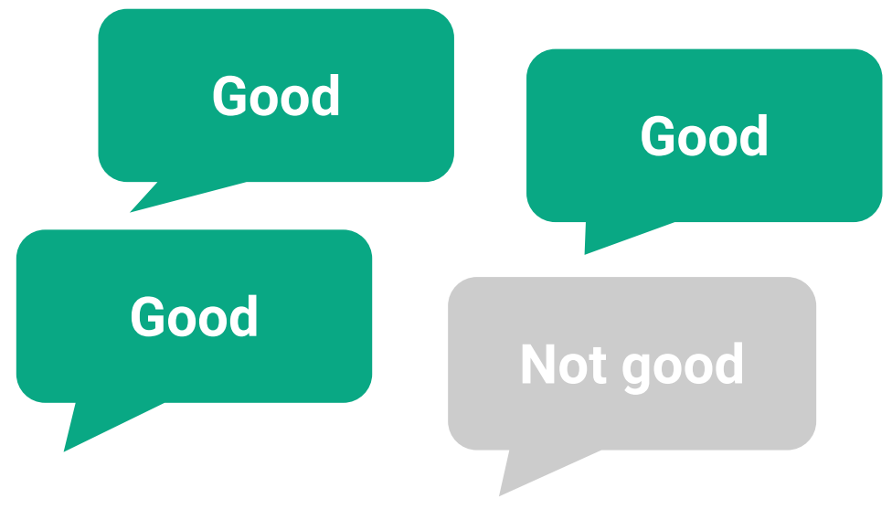

좋은 행동을 보았을 때, 좋다고 말하도록 하라.

---

# 올바르게 말하기: SBI (1/3)

피드백을 할 때에는 SBI를 포함하여 말해야 한다.

- S: Situation, 상황
- B: Behavior, 행동
- I: Impact, 영향

SBI를 포함한 피드백을 공유하면 앞으로 할 일을 논의하거나 정의하는 일이 쉬워진다.
필요시 SBI이후에 GROW 코칭을 할 수 있다.

---

# 올바르게 말하기: SBI (2/3)

| **S**ituation | **B**ehavior | **I**mpact |
| --- | --- | --- |
| 상황을 묘사한다 | 피드백 대상자의 당시 행동을 설명한다 | 행동의 영향력을 설명한다 |

- SBI **후**에 가능한 옵션을 논의하고, 다음 단계로 넘어간다
- SBI가 없으면 무슨 일에 대한 피드백인지 대상자가 인지하기 어렵다

---

# 올바르게 말하기: SBI (3/3)

<style scoped>
table {
	font-size: 20px;
}
</style>

다음은 SBI의 예시이다:

| 피드백 타입 | **S**ituation | **B**ehavior | **I**mpact |
| --- | --- | --- | --- |
| :heavy_plus_sign: 지지적 | 오늘 오전의 고객 미팅에서, | 당신이 고객 의견을 잘 들어주어<br>미팅이 원활했음 | 고객이 자신들의 요구사항이 보다<br> 명확해졌다고 내게 말했음 |
| :heavy_minus_sign: 교정적 | 당신이 과제제안서 발표를<br> 했을 때 | 평가자가 중간중간 질문하지 못하게<br> 하였음 | 평가자가 별로 유쾌하게<br> 여기지 않는 것 같았음 |

(필요한 경우)SBI 이후에 다음에 취해야 하는 행동에 대해 코칭하도록 한다.

---

# 근본 원인 분석

문제상황이 발생했을 때, 기술적 역량의 문제인지 의지의 문제인지를 확인해야 한다.

| 기술적 역량 | 의지 |
| --- | --- |
| 어떻게 해야 하는지 모름 | 동기부여가 되지 않았거나 자신감이 없음 |

해결 방안은 다음과 같다:
- **기술적 역량 부족**: 조언해주거나 코칭한다(논의하기)
- **의지 부족**: 흥미를 가질 수 있게 하거나 자신감을 가질 수 있도록 만든다

또한 리더의 기대사항이 명확했는지 점검해 보아야 한다. 기대상황이 명확했는데 문제상황이 발생하는 경우가 자주 있다면, 디브리핑을 시도한다.

---

<!-- header: AutoCrypt V2X.platform 그룹 | 리더 가이드 | **의사결정** -->
# <!--fit--> **의사결정**

---

# 의사결정 스펙트럼


한 가지 방식으로만 의사결정을 하지 않도록 주의한다. 필요에 따라 스펙트럼 내에서 움직일 수 있어야 한다.

> Consent: 동의 / Consensus: 합의

---

# 동의와 합의의 차이

동의와 합의는 유사하지만 다른 방식의 의사결정이다.

- 동의(Consent):
	- 결정사항에 대한 팀원의 강한 지지 없이 암묵적으로 결정됨
	- '선호' 보다 '견딜 수 있는 능력' 에 기인함
	- "A 방식으로 처리하기로 합시다. 혹시 반대하는 사람 있습니까?"
- 합의(Consensus):
	- 만장일치
	- 결정사항 및 결정사항의 세부사항에 대한 완전한 동의
	- 세부사항에 대한 협상 과정을 동반함
	- "A를 해야 한다고 모두 동의하였습니다"

---

# 회의

의사결정을 위해 회의를 가질 수 있다. 많은 회의에서 드러나는 갈등과 혼란은, 참석자 절반은 의사결정을 추구하고, 나머지 절반은 토론을 추구한다는 사실에서 비롯된다. 의사결정을 추구하는 이들은 나머지 절반이 진지하게 해결책을 모색하지 않는다고 화를 낸다. 반면 토론을 추구하는 이들은 나머지 절반이 사안에 대한 충분한 숙고와 다양한 관점에 대한 고려를 거부한다고 분통을 터트린다.

회의의 목적을 미리 말하는 것이 좋다. **정보 공유**나 **토론**을 위한 자리인가? **의사결정**을 위한 자리인가?

또한 대상자를 명확히 하여야 한다. **정보 공유**, **토론**, **의사결정** 모두 참석하지 않아도 되는 사람은 초대하지 않는다. 실무자의 시간을 빼앗지 마라.

---

# 바람직한 방패막이 역할[1]

팀을 효과적으로 관리하기 위해 매니저가 방패막이(혹은 헛소리 우산) 역할을 해야 한다는 조언이 있다.

중독성 있는 드라마에 불필요하게 노출된 팀은 집중하지 못하고 스트레스를 받는다. **팀이 산만하지 않도록 보호**해야 한다. 하지만 모든 것에서 팀을 보호해야 한다는 생각은 현실에 맞지 않으며, 때로는 스트레스를 팀에 공유하는 것이 좋다. 팀원과 스트레스를 나누자는 말이 아니라, **팀이 처한 상황을 함께 이해**하자는 취지이다.

쓸데없는 소문을 줄이기 위해서도 소식의 전달이 필요하다. 전달해야 할 정보를 전달하지 않았고, 팀원들이 해당 정보를 다른 경로를 통해 알게 되었을 때 불신이 발생한다.

리더는 때때로 방패가 될 수는 있지만 부모는 아니다. 팀원들을 존중하라.

> [1] 개발 7년차 매니저 1일차, 카미유 푸르니에, 2020

---

<!-- header: AutoCrypt V2X.platform 그룹 | 리더 가이드 | **목표공유** -->
# <!--fit--> **목표공유**

목표(Objective, Vision)가 우리 업무의 모든 것이다. 기업의 공유 목표를 이해하고 공감할 수 있을 때 기업의 업무가 개개인의 업무가 된다. 폭발력은 팀 전체가 목표를 공유할 때 발생한다.

---

# 기업의 목적

기업의 목적은 단 한 가지, 고객을 창조하는 것이다. 기업은 고객의 욕구에서 출발하여 만족을 창출한다. 이익은 원인이 아니라 결과다. 마케팅, 혁신, 생산성 향상의 결과로 얻어지는 것이다. 기업인들이 죄의식을 느끼고 변명할 필요를 느낀다면 사회 활동을 제대로 해 나갈 수 없다. 즉, 이익을 창출할 수 없다[1].

기업의 목적은 구성원 개개인의 공감을 얻을 수 있어야 한다. 공감하지 못하는 목적을 위해 헌신할 수 있는 사람은 없다.

> [1] 매니지먼트, 피터 드러커, 2001

---

# 목표와 몰입도

목적(목표)에 의한 관리는 피터 드러커의 저서 '경영의 실제[1]' 에서 제시된 개념이다. 피터 드러커의 철학은 "MBO & self-control" 즉 **목적에 의한 관리**와 **자기관리**로 정리되는데, 대개의 기업이 이 중 MBO, 즉 목적에 의한 관리 개념만을 가져와 적용시켰다. 자기관리가 적용되지 않음에 따라 MBO는 평가 관리 기법으로 변질되었다.

평가 관리 기법으로 전용된 경우 MBO가 구성원들에게 동기를 유발하기는 어렵다. 목적에 의한 관리와 자기 관리가 동시에 적용되어야 한다.
목적, 자기관리 모두 중요하다. "**목표가 불투명하고 의미 없는 데다 임의로 변할 때 근로자는 오히려 혼란을 느끼고 냉소적인 태도를 드러내며 동기를 상실한다**" 또한 자기관리가 없다면 시스템은 **관리자 입장의 평가로 자연스럽게 전용**된다.

> [1] 경영의 실제, 피터 드러커, 1954

---

# OKR - 개요

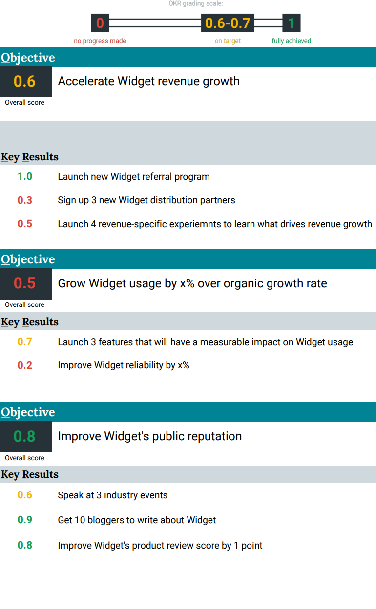

<style scoped>
p {
	font-size: 25px;
}
</style>

조직에 올바른 목표를 세우고, 구성원의 목표를 조직의 목표와 일치시키는 기법으로 OKR이 있다. **OKR은 성과 관리 기법이 아니며, 목표 관리 기법임에 유의하라**[1].

OKR은 전사, 부문, 그룹, 팀, 개인이 모두 분기별로 1~3개의 목표(Objective, O)를 정하고, 목표 하나마다 핵심결과(Key Results, KR)를 1~3개 정하는 것이다.

상위 조직의 목표를 확인하여 하위 조직(혹은 개인)의 목표를 정한다(top-down). 개인의 목표나 하위 조직의 목표로부터 상위 조직의 목표를 개선할 수도 있지만(bottom-up), 반드시 합의 과정을 거쳐야 한다.

> [1] OKR에 어울리는 성과 관리 기법으로는 CFR이 있다. 이에 대해서는 **평가하기** 에서 별도로 설명한다.

---

# OKR - 지침

OKR 수행시의 지침이다:
- 목표는 도전적이고 조금은 불편해야 한다
- OKR은 모두에게 공개되어야 한다
- 핵심결과는 측정 가능해야 한다
- 60~70% 점수를 기대하라. 항상 만점이면 목표를 올려라
- 낮은 점수는 다음 OKR을 개선하기 위한 데이터로 사용하라
- OKR은 평가 기법이 아니다
- OKR은 공유 할일 목록이 아니다

---

# OKR - 기대효과

<style scoped>
ul {
	font-size: 25px;
}
</style>

OKR의 기대효과는 크게 다음 네 가지이다[1]:

- 집중:
	- 가장 중요한 것에 집중하게 만든다
	- 집중 효과를 위해 O의 갯수를 가능한 한 적게 유지하라
- 정렬:
	- 공식적이고 투명하게 목표를 정렬시킨다
	- 목표의 정렬을 통해 협력을 창조하고 강화한다
- 추적:
	- 개선 과정과 발전 상황을 데이터화, 모니터링 할 수 있다
- 도전:
	- 편안한 영역 밖을 바라보게 하여, 성장형 사고방식을 유도한다

> [1] OKR 전설적인 벤처투자자가 구글에 전해준 성공 방식, 존 도어, 2017

---

# OKR - 예시


<style scoped>
ul {
	font-size: 23px;
}
</style>

OKR은 좌측 그림과 같이 조직과 개인의 목표를 구조화한다.

수석 코치 이하의 OKR은 매우 훌륭하다. 반면 몇 가지 잘못된 점도 있다:
- 팀 전체의 OKR에 심각한 문제가 있음:
	- 부자 구단주를 더 부자로 만들어주는 것은 개인에게 전혀 자극적인 목표가 아님
	- 개인의 목표와 방향성을 합치시킬 수 있는 목표가 좋음
- 마케팅 그룹의 핵심결과에 측정불가능한 요소가 많음
	- 예) 마케팅 부사장: 언론 보도 개선
	- KBS에서 다섯 번 특별 보도, SNS 팔로워 50% 증가 등 구체적이어야 함

---

# 개별 업무의 목적 공유 - 애자일

<style scoped>
p, ul {
	font-size: 22px;
}
</style>

애자일 개발 또한 목표 관리를 강조하고 있다. 다음은 스크럼에서 목표를 관리하는 방법이다:
- 스크럼[1]:
	- 투명성: 업무를 실행하거나 일의 결과물을 받는 사람들에게는 신규 업무 프로세스와 일이 무엇인지는 반드시 가시적이어야 한다
	- 스프린트 계획: 프로덕트 오너가 이번 스프린트에서 프로덕트가 어떻게 가치와 효용성을 높일 수 있는지를 제안한다. 전체 스크럼 팀원들이 협력해서 스프린트 목표를 정의한다. 스프린트 목표를 정의할 때에는 이 스프린트가 이해관계자들에게 중요한 이유를 담아야 한다

애자일 개발은 지적 노동자의 업무 관리 방식으로 적합하다. 애자일을 처음 도입하는 경우 스크럼을 권한다. 스크럼은 공식 가이드 문서가 있으며, 가이드 문서 내에 절차가 명확하게 기재되어 있다. 특별한 교습 없이 가이드 문서만 읽어도 따라할 수 있다.

스크럼에 익숙해졌다면 XP[2] 실천법을 도입해 보는 것도 좋다. 팀의 숙련도에 맞춰 신중하게 도입하도록 한다:

> [[1] 스크럼 가이드, 켄 슈와버 & 제프 서덜랜드, 2020](https://scrumguides.org/docs/scrumguide/v2020/2020-Scrum-Guide-Korean.pdf)
> [2] 익스트림 프로그래밍, 켄트 백 & 신시아 안드레스, 2006

---

# XP - 삶의 고리

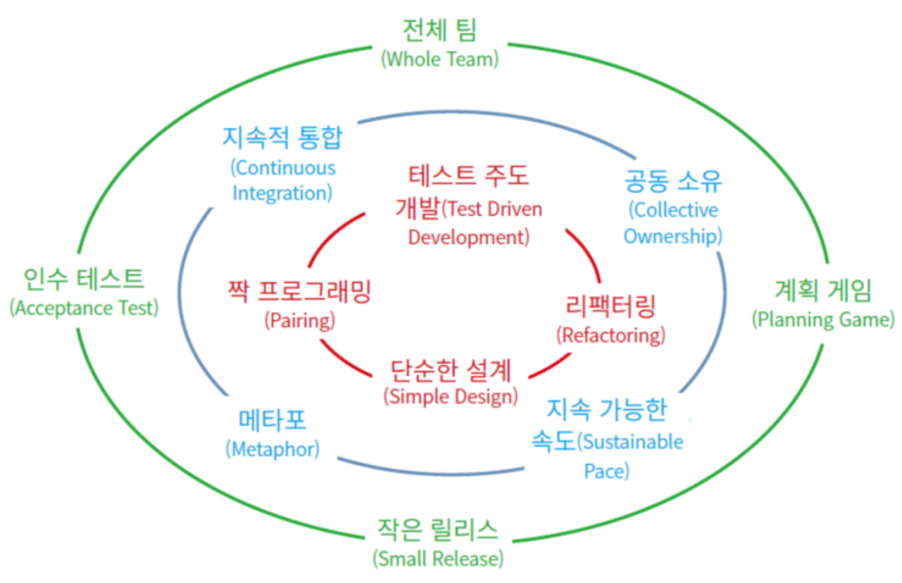

삶의 고리는 XP 실천법의 간단한 표현 형태이다.

가장 바깥쪽 고리는 사업적인 실천법이다. 중간 고리는 팀의 실천법이고, 가장 안쪽의 고리는 개개인이 수행해야 하는 기술적 실천법이다.

---

<!-- header: AutoCrypt V2X.platform 그룹 | 리더 가이드 | **평가하기** -->
# <!--fit--> **평가하기**

---

# 평가하기
공정한 평가는 가능한 것인가?
상시 성과관리
상대비교 하지 말기
성장이 둔화된 경우, 직책이 상승한 경우 등에는 줄세우기 할 수밖에 없음을 인정.

---

<!-- header: AutoCrypt V2X.platform 그룹 | 리더 가이드 | **채용관리** -->
# <!--fit--> **채용관리**

---

# 채용은 리더의 책임이다[1]

회사에 리쿠르팅 팀이 있는가? 만일 리쿠르팅 팀이 있다면, 채용을 리쿠르팅 팀이 모두 해 준다고 오해할 수도 있을 것이다.
그러나 우리는 지적 노동자이며, 다른 분야 사람이 우리 분야에 이상적인 지원자가 어떤 사람인지 알 리가 없다. 코드 작성 같은 전문 능력은 리더가 직접 평가해야 한다.

리쿠르팅 팀이 있다면 다음과 같이 활용하라:
- 이상적인 지원자의 조건을 최대한 정확히 설명한다
	- 직무기술서를 최대한 구체적으로 작성하라
	- (가능하다면)리쿠르터에게 세세한 부분을 이해시켜라

면접이 훌륭해야 훌륭한 지원자를 받을 수 있다.  [1차 면접 가이드](https://equable-chiller-c3b.notion.site/1-e208b81a1b874c53bf41ea639cc6eead)내 지침을 따르라.

> [1] 팀장의 탄생, 줄리 주오, 2019

---

# 채용은 도박이다[1] (1/3)

단 몇 시간 이야기하는 것으로 그 사람의 잠재력을 얼마나 정확히 알 수 있을까?
- 고작 30분에서 한 시간 대화로는 팀 업무 적합성을 알 수 없다
- 면접관의 편견이 평가에 영향을 미친다
- 사람은 어마어마한 변화가 가능하다

새로운 사람을 뽑는 것은 항상 위험이 따르는 도박이지만 영리하게 움직이면 그 도박도 성공할 가능성이 커진다:

> [1] 팀장의 탄생, 줄리 주오, 2019

---

# 채용은 도박이다[1] (2/3)

- 과거에 유사한 일을 한 경험이 있는지 살펴본다
- 믿을 만한 사람의 의견을 듣는다
	- 지인이 있다면 사전에 평판 조회를 한다
- 여러 사람을 면접관으로 참여시킨다(고정 면접관 그룹을 둔다)
- 면접관 중 열성 지지자가 있는지 본다. 긍정적 신호이다
- 사전에 면접 질문을 준비한다
	- 면접관의 편견이 평가에 미치는 영향을 막기 위해, <br>가능하다면 면접마다 고정된 질문을 공유한다
- 행실이 불량한 사람은 거부한다
- 많은 사람을 면접하는 일이 가치있다고 생각하라

> [1] 팀장의 탄생, 줄리 주오, 2019

---

# 채용은 도박이다[1] (3/3)

면접관 중 한명이라도 반대한다면 그 의견을 존중하자.
쎄한 느낌이 든다는 정도의 반대여도 그 의견을 받아들이자.

채용 과정에서 부정적인 편향은 중요한 의미가 있다. 채용은 도박이다. 질 것 같은 승부에 뛰어드는 도박사는 없다.

도박에 비유했다고 채용을 가볍게 여기지 않도록 한다. 채용의 책임은 리더에게 있다.

> [1] 실리콘밸리의 팀장들, 킴 스콧, 2019

---

# 떠나가는 사람 (1/2)

"각 구성원 입장에서 보면 회사는 인생에서 거쳐가는 한 단계이지 평생 다니는 곳은 아니잖아요. 얼마든지 더 좋은 여건으로 떠날 수도 있고요. 회사 입장에서도, 그 사람을 채용했다는 이유로 완전한 내 사람, 함부로 해도 되는 사람이 아니라 언제든지 떠날 수 있는 사람이라고 생각하는 게 긴장감을 주는 것 같아요. 회사는 구성원들이 떠나지 않도록 계속 좋은 복지정책, 인사정책, 업무환경 등을 만들어야 하고 ... 그럼에도 불구하고 막상 퇴사한다는 이야기를 들으면 조금 섭섭하긴 합니다. 마치 내가 퇴사당하는 것 같아요.  ... 처음엔 많이 섭섭했는데 시간이 지나니까 한 인간으로서 그 사람을 응원하게 돼요. ... 진심으로 축하해주고 ... '나가보니까 이만한 곳이 없다, 돌아오겠다' 하면 다시 환영하는 게 더 좋은 그림이고요[1]"

> [1] 이게 무슨 일이야! 김봉진 의장 부분, 우아한 형제들, 2022

---

# 떠나가는 사람 (2/2)

떠나가는 사람의 능력이 좋으면 좋을수록 배신감을 느낄 수 있다. 배신감을 느끼지 말라. 할 수 있는 노력을 다 했지만 떠나가는 사람이라면 좋은 말과 함께 떠나보내도록 한다.

떠나가는 사람은 이전까지 하지 못했던 말을 보다 홀가분하게 할 수 있다. 가능하다면 회고 면담을 가진다. 회고 면담을 남은 사람들을 위한 자료로 사용한다.

다음은 넷플릭스가 사용하는 회고 템플릿이다:

- 왜 떠나는가
- 회사에서 배운 것
- 회사에 아쉬운 점
- 앞으로의 계획
- 넷플릭스의 메시지

---

# 떠나 보내게 된 사람

해고는 법률적으로도 어렵지만 감정적으로도 결코 쉽지 않은 일이다:
- 해고가 빈번한 조직에서는 고성과자마저 불안감을 느낀다
- 해고가 불가능한 조직에서는 조직이 정치적이게 된다
	- 리더는 저성과자를 떠넘기려 한다
	- 고성과자는 저성과자와의 협업을 회피한다
	- 저성과자는 개선의 노력을 보이지 않는다

해고는 힘든 일이다. 가장 중요한 것은 이성적으로 원칙을 지키는 것이다.

---

# 저성과자 판별 (1/2)

저성과자 판별은 반드시 일찍 수행되어야 한다. 네 가지 이유가 있다[1]:
- 저성과자에게 공정하기 위함이다
	- 저성과자에게 문제를 해결하기 위한 시간을 줄 수 있다
- 기업에게 공정하기 위함이다
	- 수습 기간 중에 문제가 확인 가능한 편이 좋다
- 자기 자신에게 공정하기 위함이다
	- 몇년간 함께 일한 동료는 당신과 신뢰관계가 쌓인 동료이다
	- 신뢰관계가 있는 사람을 해고하는 것은 신뢰를 무너트린다
- 고성과자에게 공정하기 위함이다

> [1] 실리콘밸리의 팀장들, 킴 스콧, 2019

---

# 저성과자 판별 (2/2)

저성과자 판별은 빠르게 수행되어야 하나, 또한 신중해야 한다:
- 쉽게 사람을 포기하는 행위는 신뢰를 무너트린다
- **리더의 믿음은 자기실현적이다**. 저성과자로 낙인찍으면 저성과자가 된다
- 경력직일 경우 조직문화에 적응하지 못했을 수 있다. 최초 기대 중심으로 바라보라
- 저성과자로 대응하기 전에 상위 리더와 인식을 공유한다
	- 가능하면 다면평가를 수행하라. 기밀성은 유지해야 한다

---

# 저성과자 관리 (1/2)

저성과자가 있는 경우 중요한 의사결정을 내리기 전에 반드시 인사팀에 도움을 청하라.

저성과자로 판정했다면 다음 사항을 점검하라[1]:
- 완전하게 솔직한 조언을 주었는가?
	- 리더가 개선시키기 위해 노력했어야 한다. 노력해보지 않았다면 판단하지 말라
	- 관리 대상임을 명확하고 이해가 가게 전달해야 한다
- (대상자가) 자신의 성과가 팀에 어떤 영향을 미치는지 정확하게 이해하고 있는가?
	- 리더가 파악했을 정도면 다른 동료들도 영향을 받았을 가능성이 크다. 확인하라
- 다른 사람에게 조언을 구했는가?
	- 최소한 상위 리더와는 인식을 공유해야 한다

> [1] 실리콘밸리의 팀장들, 킴 스콧, 2019

---

# 저성과자 관리 (2/2)

<style scoped>
p, ul {
	font-size: 22px;
}
</style>

저성과자에게 통지 및 개선 방안 논의를 수행하였고, 성과 개선 기회(평가를 위한 개선 기회임을 인지시켜야 한다)를 부여하였고, 직무나 팀 재배치를 시도하는 등 다양한 방법을 시도하였지만 개선이 이루어지지 않았다면 최종적인 조치를 취해야 한다. 모든 시도를 하였음에도 다음과 같은 자기 합리화를 하지 말자:
- 나아질지 모른다 / 그래도 사람이 없는 것보단 낫다 / 해고하면 팀 사기에 악영향을 미친다

해고는 힘든 일이지만 더 힘든 것은 해고해야 할 사람을 해고하지 않는 것이다. 하지만 그를 해고하는 이유가 그가 무능하거나 바보라서가 아니라, 맡은 자리와 잘 어울리지 않았을 뿐임을 명심하자.

해고를 하게 되었다면 감정적이지 않을 수 있도록 최대한 노력하라. 해고는 감정적으로 쉽지 않은 일이기 때문에 감정에 쉽게 휘둘릴 수 있다. 고심하여 결정하였다면 번복하지 말고, 빠르게 결정사항을 이행하라.

해고 사실은 리더가 직접 전달하라. 특히 직접 채용한 직원이라면 더더욱 직접 대화하라. 떠나보낼 사람이지만 어떤 식으로든 도움을 줄 수 있다. 해고 절차가 상대의 입장에서 수월하게 진행될 수 있도록 배려하고, 위험과 어려움을 감수하자.

해고 후 상위 리더와 회고 회의를 갖고 개선점을 논의한다. 수습기간 중 해고도 포함한다. 해고는 채용의 실패다.

---

<!-- header: AutoCrypt V2X.platform 그룹 | 리더 가이드 | **부록: 업무 일정표** -->
# <!--fit--> **부록: 업무 일정표**

---

# 연간 일정표

- 2주 남기고 준비하기 시작하라
- 인사평가가 끝났을 때부터 시작하기

아래 일정 정리할 것
- 전사 인사 일정
- OKR
- CFR
- 스킵 레벨 미팅
- One simple thing
- 리더 회식

> 전사 일정의 변동에 따라 세부사항은 수정될 수 있음

---

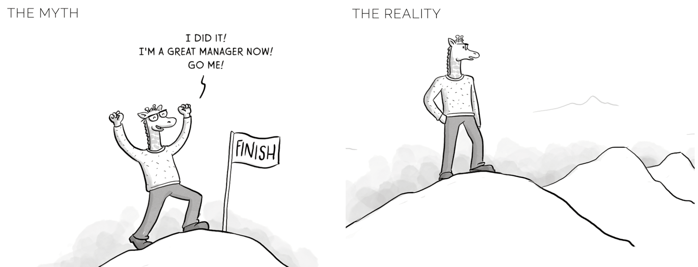

:tada: 리더 가이드를 따라와주셔서 감사합니다. 앞으로도 잘 부탁드리겠습니다!

<!-- ---

# Marp 기초 문법 (1/2)

<style scoped>
ul {
	font-size: 25px;
}
</style>

- 오리지널 마크다운 문법을 지원함(Mermaid 등 익스텐션은 미지원)
- themes를 통해 css 스타일 변경 가능
- itemize:
	- '*' 사용시 한 페이지당 하나씩 출력됨. 한번에 출력하려면 '-'
- Emoji: :satellite:
- Strikethrough: ~~strike~~
- Equation: $a = \frac{b}{c}$
- Code: `#include <iostream>`
- Code blocks:
```c++
#include <iostream>

void main;
```

---

# Marp 기초 문법 (2/2)
- images:


- Tables:

| foo | bar |
| --- | --- |
| baz | bim | -->